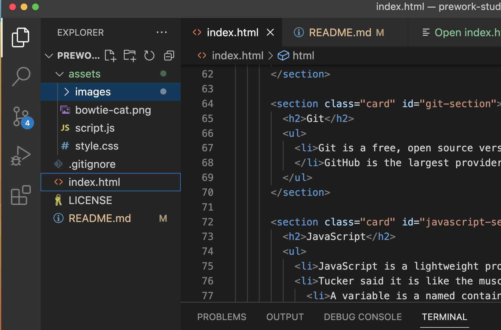

# Prework Study Guide Webpage

## Description
This Prework Study Guide was created for boot camp students who were going through the Prework. It contains notes on HTML, CSS, Git, and JavaScript.

- What was your motivation? 
To record notes of things I learned in pre-work about HTML, CSS, Git, and JavaScript
- Why did you build this project? 
This project was built to assist a bootcamp student by listing out key information learned during pre-work.
- What problem does it solve?
Creating this project allows a student learning web development to understand the key features of HTML, CSS, Git, and JavaScript and view some code.
- What did you learn?
I learned how HTML code in an index file can link to a CSS stle sheet to make the website design pretty. In addition, the JavaScript allows a dynamic interface for the user.

## Installation 
N/A

## Usage
This webpage lists these topics: HTML, CSS, GIT, and JavaScrript along with some notes under each element. Looking at the code that generates these elements is useful for a bootcamp student. When we open the Chrove DevTools console, we can see the output that the JavaScript creates as it runs. The output will list the four topics and randomly choose a topic for  us to study first.

Steps to open the web page and code.

1. Change the directory to  prework-study-guide repository. Use the computer's terminal. (cd /bootcamp/prework-study-guide)
2. Open Visual Source Code editor for the prework-study-guide repository. (code .)
3. View the files listed.
4. Bring up the web page by Right clicking on index.html and choose "open with Live Server" Image here: 
5. Open DevOps for Chrome by right clicking anywhere on the web page (from step 4), Choose "Inspect"
6. View the console log output to see the Java Script running - Click "Console" tab.

## Credits
N/A
No collaborators.

Tutorial:
Pre-Work Repository
3.5.3 Create a Professional Project README 
https://courses.bootcampspot.com/courses/3115/pages/3-dot-5-3-create-a-professional-project-readme?module_item_id=784127

## License
Please refer to the LICENSE in the repo.

## Badges
N/A

## Features
N/A

## How to Contribute
N/A

## Tests
N/A